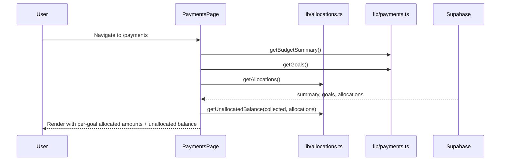
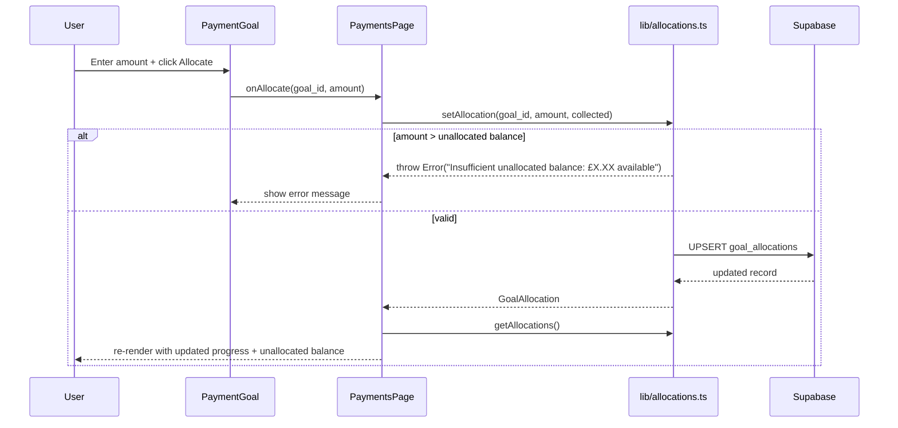

# Design Document: Budget Allocation

## Overview

This feature adds explicit fund allocation to the existing payments system. Currently every money goal shows progress against the full `total_collected` pool, which is misleading — all goals show the same number. Budget allocation lets a manager earmark specific amounts from the collected pool to individual goals, so each goal's progress bar reflects only the funds deliberately assigned to it.

The unallocated balance (collected minus all allocations) is always visible so the manager knows exactly how much is still free to distribute.

The feature is additive: it introduces a new `goal_allocations` table, a new `lib/allocations.ts` library, and updates the `PaymentGoal` component and payments page. No existing tables or APIs are modified.

## Architecture

```mermaid
graph TD
    subgraph Pages
        PAY[/payments]
    end

    subgraph Components
        BS[BudgetSummary]
        PG[PaymentGoal]
    end

    subgraph Lib
        LA[lib/allocations.ts]
        LP[lib/payments.ts]
    end

    subgraph DB["Supabase (Postgres)"]
        TPAY[(payments)]
        TGL[(payment_goals)]
        TALL[(goal_allocations)]
    end

    PAY --> BS & PG
    PAY --> LA & LP
    LA --> TALL
    LP --> TPAY & TGL
    TALL -->|goal_id FK| TGL
```

### Data Flow on Page Load



### Allocation Set/Update Flow



## Components and Interfaces

### PaymentGoal (updated)

Accepts `allocated_amount` instead of `collected`. Shows the allocation inline with an input to set/update/remove it.

```typescript
interface PaymentGoalProps {
  goal: MoneyGoal;
  allocatedAmount: number;           // 0 if no allocation exists
  unallocatedBalance: number;        // passed down for validation feedback
  onAllocate: (goalId: string, amount: number) => Promise<void>;
  onRemoveAllocation: (goalId: string) => Promise<void>;
  allocationError?: string | null;   // error message from parent
}
```

**Responsibilities**:
- Render progress bar as `allocatedAmount / target_amount` (capped at 100%)
- Show `£allocatedAmount / £target_amount` label
- Inline input + "Allocate" button to set or update the allocation
- "Remove" button when an allocation exists
- Display `allocationError` inline when set

### BudgetSummary (updated)

Receives an additional `unallocatedBalance` prop to display alongside the existing summary cards.

```typescript
interface BudgetSummaryProps {
  summary: BudgetSummary;
  unallocatedBalance: number;
}
```

The unallocated balance is shown as a new card in the summary row (e.g. "Unallocated" in amber/yellow to distinguish it from the green balance).

### PaymentsPage (updated)

Adds `allocations` state, fetches from `getAllocations()` on load, passes per-goal allocated amounts down to each `PaymentGoal`, and handles `onAllocate` / `onRemoveAllocation` callbacks.

## Data Models

### GoalAllocation (new type)

```typescript
export interface GoalAllocation {
  id: string;
  goal_id: string;
  allocated_amount: number;
  updated_at: string;
}
```

### Database Schema

```sql
-- football-manager/supabase/migrations/20240004_goal_allocations.sql
CREATE TABLE goal_allocations (
  id             uuid PRIMARY KEY DEFAULT gen_random_uuid(),
  goal_id        uuid NOT NULL UNIQUE REFERENCES payment_goals(id) ON DELETE CASCADE,
  allocated_amount numeric NOT NULL CHECK (allocated_amount > 0),
  updated_at     timestamptz NOT NULL DEFAULT now()
);
```

Key constraints:
- `UNIQUE (goal_id)` — one allocation record per goal (upsert replaces it)
- `CHECK (allocated_amount > 0)` — DB-level guard matching application validation
- `ON DELETE CASCADE` — removing a goal automatically removes its allocation

## lib/allocations.ts — Function Specifications

### `getAllocations(): Promise<GoalAllocation[]>`

Fetches all rows from `goal_allocations`.

**Postconditions**:
- Returns an array (empty if no allocations exist, never throws for missing data)

### `setAllocation(goal_id, amount, collected): Promise<GoalAllocation>`

Upserts a `goal_allocations` row for the given goal.

**Preconditions**:
- `amount > 0` (throws `"Allocation amount must be greater than zero"` otherwise)
- `amount <= getUnallocatedBalance(collected, currentAllocations)` where `currentAllocations` excludes the existing allocation for this goal (throws `"Insufficient unallocated balance: £X.XX available"` otherwise)

**Postconditions**:
- Exactly one row exists in `goal_allocations` for `goal_id` with `allocated_amount = amount`
- Returns the upserted `GoalAllocation`

**Note**: The function fetches current allocations from the DB to compute the effective unallocated balance before writing. The existing allocation for the same `goal_id` is excluded from the sum so that updating an allocation doesn't double-count it.

### `removeAllocation(goal_id): Promise<void>`

Deletes the `goal_allocations` row for the given goal.

**Postconditions**:
- No row exists in `goal_allocations` for `goal_id`
- Does not throw if no row existed

### `getUnallocatedBalance(collected: number, allocations: GoalAllocation[]): number` (pure)

**Postconditions**:
- Returns `collected - sum(allocations.map(a => a.allocated_amount))`
- Returns `0` when `collected === 0` and `allocations` is empty
- Never returns a negative number in practice (application validation prevents over-allocation, but the function itself does not clamp)

## Correctness Properties

*A property is a characteristic or behavior that should hold true across all valid executions of a system — essentially, a formal statement about what the system should do. Properties serve as the bridge between human-readable specifications and machine-verifiable correctness guarantees.*

### Property 1: Unallocated balance computation

*For any* non-negative `collected` amount and any array of `GoalAllocation` records, `getUnallocatedBalance(collected, allocations)` SHALL equal `collected` minus the sum of all `allocated_amount` values in the array.

**Validates: Requirements 1.2, 6.4, 6.6**

### Property 2: Non-positive amounts are rejected

*For any* amount that is zero or negative, `setAllocation` SHALL throw an error before writing to the database.

**Validates: Requirements 2.2**

### Property 3: Over-allocation is rejected

*For any* combination of `collected`, existing allocations, and a new `amount` where `amount` exceeds the effective unallocated balance, `setAllocation` SHALL throw a descriptive error before writing to the database.

**Validates: Requirements 2.3, 4.2, 6.5**

### Property 4: Goal progress percentage formula

*For any* `allocatedAmount >= 0` and `target_amount > 0`, the displayed progress percentage SHALL equal `Math.min((allocatedAmount / target_amount) * 100, 100)`.

**Validates: Requirements 3.1, 3.2**

### Property 5: Allocation upsert replaces previous value

*For any* `goal_id` and two different positive amounts `a1` and `a2`, calling `setAllocation(goal_id, a1, ...)` followed by `setAllocation(goal_id, a2, ...)` SHALL result in exactly one record for `goal_id` with `allocated_amount = a2`.

**Validates: Requirements 4.1, 5.3**

### Property 6: Remove restores unallocated balance

*For any* `goal_id` and positive `amount`, allocating then removing SHALL result in the unallocated balance returning to its value before the allocation was made.

**Validates: Requirements 4.3**

## Error Handling

### Over-allocation attempt

**Condition**: `setAllocation` called with `amount > unallocated balance`
**Response**: Throws `Error("Insufficient unallocated balance: £X.XX available")` before any DB write
**UI**: `PaymentGoal` displays the error message inline below the allocation input; the input retains the entered value so the user can correct it

### Zero or negative amount

**Condition**: `setAllocation` called with `amount <= 0`
**Response**: Throws `Error("Allocation amount must be greater than zero")`
**UI**: Inline error on the `PaymentGoal` input

### DB write failure

**Condition**: Supabase returns an error on upsert/delete
**Response**: `setAllocation` / `removeAllocation` re-throws the Supabase error
**UI**: `PaymentsPage` catches and sets an error state; displayed inline on the relevant goal card

### Goal deleted while allocation exists

**Condition**: A `payment_goals` row is deleted that has a `goal_allocations` row
**Response**: `ON DELETE CASCADE` automatically removes the allocation — no orphaned records
**Recovery**: Unallocated balance increases automatically on next page load

## Testing Strategy

### Unit Tests (example-based)

- `getUnallocatedBalance` with zero collected and empty allocations → 0
- `getUnallocatedBalance` with collected=100 and one allocation of 40 → 60
- `PaymentGoal` renders 0% progress when `allocatedAmount=0`
- `PaymentGoal` renders correct currency strings
- `PaymentGoal` caps progress at 100% when `allocatedAmount > target_amount`
- `BudgetSummary` renders the unallocated balance card

### Property-Based Tests (fast-check)

Each property test runs a minimum of 100 iterations.

**Property 1 — Unallocated balance computation**
```
Feature: budget-allocation, Property 1: unallocated balance equals collected minus sum of allocations
```
Generate: arbitrary `collected >= 0`, arbitrary array of allocations with `allocated_amount > 0`
Assert: `getUnallocatedBalance(collected, allocations) === collected - sum(allocations)`

**Property 2 — Non-positive amounts rejected**
```
Feature: budget-allocation, Property 2: non-positive amounts are rejected
```
Generate: any `amount <= 0`
Assert: `setAllocation(anyGoalId, amount, anyCollected)` throws

**Property 3 — Over-allocation rejected**
```
Feature: budget-allocation, Property 3: over-allocation is rejected
```
Generate: `collected`, existing allocations, `amount > getUnallocatedBalance(collected, allocations)`
Assert: `setAllocation` throws with message containing the available balance

**Property 4 — Progress percentage formula**
```
Feature: budget-allocation, Property 4: goal progress percentage formula
```
Generate: `allocatedAmount >= 0`, `target_amount > 0`
Assert: computed percent equals `Math.min((allocatedAmount / target_amount) * 100, 100)`

**Property 5 — Upsert replaces previous value**
```
Feature: budget-allocation, Property 5: allocation upsert replaces previous value
```
Generate: `goal_id`, two distinct positive amounts `a1`, `a2`
Assert: after two sequential `setAllocation` calls, only one record exists with `allocated_amount = a2`
(Use mocked Supabase to avoid DB dependency)

**Property 6 — Remove restores balance**
```
Feature: budget-allocation, Property 6: remove restores unallocated balance
```
Generate: `collected`, existing allocations, new `goal_id` and `amount` within unallocated balance
Assert: `getUnallocatedBalance` after allocate-then-remove equals `getUnallocatedBalance` before allocate

### Integration Tests

- Page load fetches `getAllocations()` and computes unallocated balance before render (mock Supabase)
- Successful allocation updates goal progress and unallocated balance in UI state
- Allocation rejection displays error message with available amount
