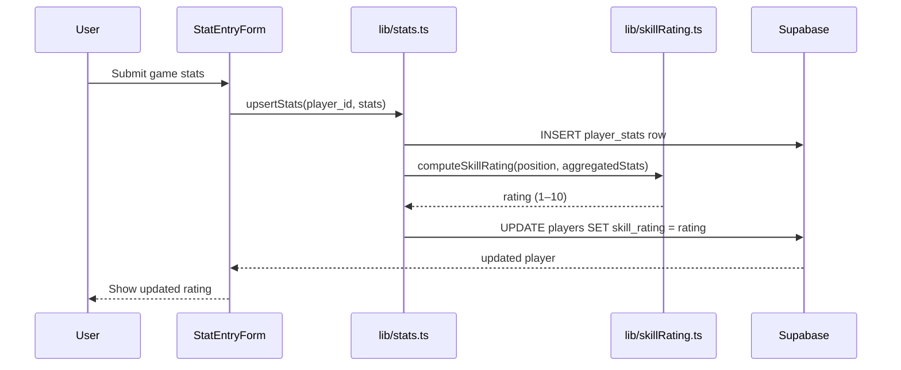
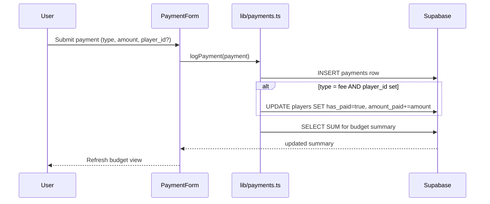
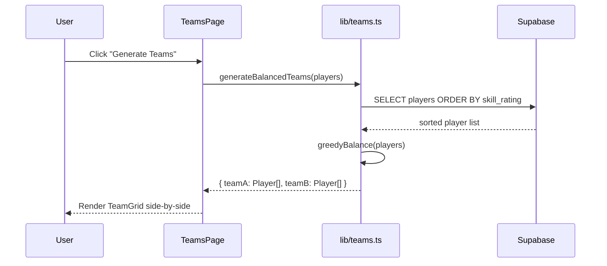

# Design Document: Player Stats & Payments

## Overview

This feature extends the football manager app with two interconnected systems: a position-aware player stats engine that auto-computes skill ratings, and a full payments/budget tracker. Stats feed directly into team balancing, replacing the manual skill slider with data-driven ratings. The payments system tracks individual player fees and team-level income/expenses against configurable money goals.

The two systems share the `Player` entity as a common anchor — stats determine a player's computed `skill_rating`, while payments track their `has_paid` / `amount_paid` status. Both systems write back to the `players` table so the existing `PlayerTable` and team balancer continue to work without changes to their interfaces.

## Architecture

```mermaid
graph TD
    subgraph Pages
        PL[/players]
        PD[/players/id]
        PAY[/payments]
        TM[/teams]
    end

    subgraph Components
        PT[PlayerTable]
        PF[PlayerForm]
        SC[StatsCard]
        SE[StatEntryForm]
        BS[BudgetSummary]
        PH[PaymentHistory]
        PG[PaymentGoal]
        TG[TeamGrid]
    end

    subgraph Lib
        LP[lib/players.ts]
        LS[lib/stats.ts]
        LPAY[lib/payments.ts]
        LT[lib/teams.ts]
        LRATING[lib/skillRating.ts]
    end

    subgraph DB["Supabase (Postgres)"]
        TP[(players)]
        TS[(player_stats)]
        TPAY[(payments)]
        TGL[(payment_goals)]
    end

    PL --> PT & PF
    PD --> SC & SE
    PAY --> BS & PH & PG
    TM --> TG

    PT --> LP
    PF --> LP
    SC --> LS
    SE --> LS
    BS & PH --> LPAY
    PG --> LPAY
    TG --> LT

    LP --> TP
    LS --> TS
    LS --> LRATING
    LRATING --> TP
    LPAY --> TPAY & TGL
    LT --> TP
```

## Sequence Diagrams

### Stat Entry → Skill Rating Update



### Payment Logging → Budget Update



### Team Generation



## Components and Interfaces

### StatsCard

**Purpose**: Displays a player's aggregated stats and computed skill rating on the detail page.

**Interface**:
```typescript
interface StatsCardProps {
  player: Player
  stats: AggregatedStats
}
```

**Responsibilities**:
- Render position-specific stat fields (only relevant stats per position)
- Show computed skill rating with visual bar
- Link to stat entry form

### StatEntryForm

**Purpose**: Modal form for logging per-game stats for a player.

**Interface**:
```typescript
interface StatEntryFormProps {
  player: Player
  onSubmit: (stats: StatEntryData) => Promise<void>
  onCancel: () => void
}
```

**Responsibilities**:
- Show only the stat fields relevant to the player's position
- Validate non-negative integers
- Trigger skill rating recomputation on submit

### BudgetSummary

**Purpose**: Shows total collected, total expenses, and current balance at the top of the payments page.

**Interface**:
```typescript
interface BudgetSummaryProps {
  summary: BudgetSummary
}
```

### PaymentHistory

**Purpose**: Paginated list of all payment records with player name, type, amount, and date.

**Interface**:
```typescript
interface PaymentHistoryProps {
  payments: PaymentWithPlayer[]
  onDelete: (id: string) => Promise<void>
}
```

### PaymentGoal

**Purpose**: Displays a named money goal with a progress bar.

**Interface**:
```typescript
interface PaymentGoalProps {
  goal: MoneyGoal
  collected: number
}
```

### TeamGrid

**Purpose**: Renders two balanced teams side by side with player cards.

**Interface**:
```typescript
interface TeamGridProps {
  teamA: Player[]
  teamB: Player[]
}
```

## Data Models

### Extended PlayerStats (replaces existing stub)

```typescript
// Stored in player_stats table — one row per game per player
interface PlayerStats {
  id: string
  player_id: string
  // Shared
  games_played: number      // always 1 per entry (aggregated in queries)
  // GK
  saves?: number
  goals_conceded?: number
  clean_sheets?: number
  // DEF
  tackles?: number
  interceptions?: number
  // MID
  key_passes?: number
  // FWD / shared attacking
  goals?: number
  assists?: number
  shots_on_target?: number
  recorded_at: string       // ISO date of the game
}

// Aggregated view used in UI
interface AggregatedStats {
  games_played: number
  goals: number
  assists: number
  // position-specific totals
  saves?: number
  goals_conceded?: number
  clean_sheets?: number
  tackles?: number
  interceptions?: number
  key_passes?: number
  shots_on_target?: number
}
```

**Validation Rules**:
- All numeric fields ≥ 0
- `recorded_at` must be a valid ISO date string
- `player_id` must reference an existing player

### MoneyGoal

```typescript
interface MoneyGoal {
  id: string
  title: string           // e.g. "New jerseys fund"
  target_amount: number   // e.g. 500
  created_at: string
}
```

**Validation Rules**:
- `target_amount` > 0
- `title` non-empty, max 100 chars

### PaymentWithPlayer (join type for UI)

```typescript
interface PaymentWithPlayer extends Payment {
  player_name: string | null  // null for general team payments
}
```

### BudgetSummary (computed)

```typescript
interface BudgetSummary {
  total_collected: number   // SUM of fees + income
  total_expenses: number    // SUM of expenses (absolute)
  balance: number           // total_collected - total_expenses
}
```

## Skill Rating Algorithm

The skill rating (1–10) is computed from aggregated stats using position-specific weighted formulas. This replaces the manual slider.

### Weight Tables

```typescript
// GK formula
// rating = clamp(1, 10,
//   (clean_sheets * 2.0 + saves * 0.3 - goals_conceded * 0.5) / games_played * scale + base
// )

const GK_WEIGHTS = {
  clean_sheets: 2.0,
  saves: 0.3,
  goals_conceded: -0.5,
}

// DEF formula
const DEF_WEIGHTS = {
  tackles: 0.4,
  interceptions: 0.4,
  goals: 1.5,
  assists: 1.0,
}

// MID formula
const MID_WEIGHTS = {
  goals: 1.5,
  assists: 1.2,
  key_passes: 0.5,
}

// FWD formula
const FWD_WEIGHTS = {
  goals: 2.0,
  assists: 1.0,
  shots_on_target: 0.3,
}
```

### Algorithm

```typescript
function computeSkillRating(position: Position, stats: AggregatedStats): number
```

**Preconditions**:
- `stats.games_played` > 0
- All stat values ≥ 0

**Postconditions**:
- Returns integer in range [1, 10]
- Higher performance stats → higher rating
- A player with 0 games played defaults to their existing manual rating (no overwrite)

**Algorithm (per-game normalisation)**:

```pascal
FUNCTION computeSkillRating(position, stats)
  IF stats.games_played = 0 THEN
    RETURN existing_rating  // no data yet, keep manual value
  END IF

  weights ← WEIGHT_TABLE[position]
  raw_score ← 0

  FOR each (stat_key, weight) IN weights DO
    raw_score ← raw_score + (stats[stat_key] / stats.games_played) * weight
  END FOR

  // Normalise to 1–10 scale using position-specific max expected score
  normalised ← (raw_score / MAX_SCORE[position]) * 9 + 1

  RETURN clamp(ROUND(normalised), 1, 10)
END FUNCTION
```

## Team Balancing Algorithm

```typescript
function generateBalancedTeams(players: Player[]): { teamA: Player[]; teamB: Player[] }
```

**Preconditions**:
- `players.length` ≥ 2

**Postconditions**:
- Every player appears in exactly one team
- `|sum(teamA.skill_rating) - sum(teamB.skill_rating)|` is minimised
- Teams differ in size by at most 1 player

**Algorithm (greedy snake draft)**:

```pascal
FUNCTION generateBalancedTeams(players)
  sorted ← SORT players BY skill_rating DESCENDING
  teamA ← []
  teamB ← []
  sumA ← 0
  sumB ← 0

  FOR each player IN sorted DO
    IF sumA <= sumB THEN
      APPEND player TO teamA
      sumA ← sumA + player.skill_rating
    ELSE
      APPEND player TO teamB
      sumB ← sumB + player.skill_rating
    END IF
  END FOR

  RETURN { teamA, teamB }
END FUNCTION
```

**Loop Invariant**: After each iteration, `|sumA - sumB| ≤ max_skill_rating` (the greedy choice keeps teams within one player's rating of each other).

## Key Functions with Formal Specifications

### `upsertStats(player_id, stats)`

```typescript
async function upsertStats(
  player_id: string,
  stats: Omit<PlayerStats, 'id' | 'player_id'>
): Promise<Player>
```

**Preconditions**:
- `player_id` exists in `players` table
- All numeric stat fields ≥ 0

**Postconditions**:
- New row inserted in `player_stats`
- `players.skill_rating` updated to `computeSkillRating(player.position, aggregatedStats)`
- Returns updated `Player` with new `skill_rating`

### `getAggregatedStats(player_id)`

```typescript
async function getAggregatedStats(player_id: string): Promise<AggregatedStats>
```

**Preconditions**:
- `player_id` is a valid UUID string

**Postconditions**:
- Returns summed stats across all `player_stats` rows for that player
- Returns zero-valued `AggregatedStats` if no rows exist (never throws for missing data)

### `logPayment(payment)`

```typescript
async function logPayment(
  payment: Omit<Payment, 'id' | 'paid_at'>
): Promise<Payment>
```

**Preconditions**:
- `payment.amount` > 0
- `payment.type` ∈ `{ "fee", "expense", "income" }`
- If `payment.player_id` is set, it must reference an existing player

**Postconditions**:
- Row inserted in `payments`
- If `type === "fee"` and `player_id` is set: `players.has_paid = true`, `players.amount_paid += amount`
- Returns the created `Payment` record

### `getBudgetSummary()`

```typescript
async function getBudgetSummary(): Promise<BudgetSummary>
```

**Postconditions**:
- `total_collected = SUM(amount) WHERE type IN ('fee', 'income')`
- `total_expenses = SUM(amount) WHERE type = 'expense'`
- `balance = total_collected - total_expenses`

## Example Usage

```typescript
// Log a game's stats for a FWD player
const updatedPlayer = await upsertStats(player.id, {
  goals: 2,
  assists: 1,
  shots_on_target: 4,
  games_played: 1,
  recorded_at: new Date().toISOString(),
})
console.log(updatedPlayer.skill_rating) // e.g. 8

// Log a fee payment
const payment = await logPayment({
  player_id: player.id,
  amount: 25,
  type: "fee",
  description: "Monthly fee - January",
})

// Get budget summary
const summary = await getBudgetSummary()
// { total_collected: 250, total_expenses: 80, balance: 170 }

// Generate balanced teams
const { teamA, teamB } = generateBalancedTeams(players)
// teamA avg rating ≈ teamB avg rating
```

## Correctness Properties

```typescript
// P1: Skill rating is always in valid range
∀ player: Player → player.skill_rating >= 1 && player.skill_rating <= 10

// P2: computeSkillRating is deterministic
∀ (position, stats) → computeSkillRating(position, stats) === computeSkillRating(position, stats)

// P3: Budget balance identity
balance === total_collected - total_expenses

// P4: Team balancing covers all players
∀ players → teamA.length + teamB.length === players.length
∀ player ∈ players → (player ∈ teamA XOR player ∈ teamB)

// P5: Team size difference is at most 1
|teamA.length - teamB.length| <= 1

// P6: Fee payment marks player as paid
∀ payment where type='fee' AND player_id set →
  players[player_id].has_paid === true AFTER logPayment(payment)

// P7: Stats aggregation is additive
getAggregatedStats(id).goals === SUM of all player_stats rows goals for that player
```

## Error Handling

### Missing Stats (New Player)

**Condition**: Player has no `player_stats` rows yet
**Response**: `getAggregatedStats` returns zeroed struct; UI shows "No stats recorded yet"
**Recovery**: Skill rating remains at manually-set value until first stat entry

### Invalid Stat Entry

**Condition**: Negative numbers or non-integer values submitted
**Response**: Client-side validation rejects before submission; error message shown inline
**Recovery**: User corrects input and resubmits

### Payment with Invalid Player

**Condition**: `player_id` references a deleted player
**Response**: Supabase foreign key constraint returns error; `logPayment` throws
**Recovery**: UI catches error, shows toast notification, payment not recorded

### Insufficient Data for Rating

**Condition**: `games_played = 0` after aggregation (edge case: stats rows with 0 games)
**Response**: `computeSkillRating` returns existing `skill_rating` unchanged
**Recovery**: No action needed; rating updates on next valid stat entry

## Testing Strategy

### Unit Testing Approach

Test pure functions in isolation:
- `computeSkillRating` for each position with known inputs → expected rating
- `generateBalancedTeams` with various roster sizes (even, odd, 2 players, 20 players)
- `getBudgetSummary` aggregation logic with mocked payment arrays

### Property-Based Testing Approach

**Property Test Library**: fast-check

Key properties to test:
- `computeSkillRating` always returns integer in [1, 10] for any valid stats
- `generateBalancedTeams` always assigns every player to exactly one team
- `|teamA.rating_sum - teamB.rating_sum|` is minimised vs. random assignment
- Budget balance identity holds for any combination of payment types

### Integration Testing Approach

- Stat entry → skill rating update flow (mock Supabase)
- Payment logging → player `has_paid` sync (mock Supabase)
- Full payments page load with budget summary calculation

## Performance Considerations

- Stats aggregation (`getAggregatedStats`) uses a Supabase `SELECT SUM` query rather than fetching all rows client-side — scales to hundreds of games per player
- Budget summary uses a single aggregation query grouped by `type`
- Team generation is O(n log n) due to sort; fine for rosters up to ~50 players
- Player detail page fetches stats and player data in parallel (`Promise.all`)

## Security Considerations

- All Supabase queries use parameterised inputs (no raw SQL interpolation)
- `player_id` foreign key enforced at DB level to prevent orphaned payment records
- Payment amounts validated as positive numbers client-side and enforced via DB `CHECK` constraint
- No sensitive financial data beyond team fee amounts; standard Supabase RLS policies apply

## Dependencies

- `@supabase/supabase-js` — already installed, used for all DB operations
- `fast-check` — add as dev dependency for property-based tests
- No new UI libraries needed; Tailwind CSS covers all new components
- New Supabase tables required: `player_stats` (extended schema), `payment_goals`
- Existing `payments` table schema matches the `Payment` type already defined
